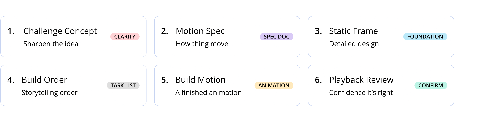

# Guided Animation

Give your AI a structured animation process instead of letting it improvise. Without these skills, AI tools animate randomly — no intent behind the easing, no thought in the choreography. With them, you describe what you want and get a GIF, video, or prototype that matches your vision.



## How to install

You only need to do this once. Open a terminal (on Mac: search for "Terminal" in Spotlight) and paste this command:

```bash
npx skills add GalitBarFuertesDesign/guided-animation
```

**Don't have Node.js?** You need it to run the command above. [Download it here](https://nodejs.org) — pick the version marked "LTS" and install it like any other app. Then try the command again.

Works with Claude Code, Cursor, Codex, Windsurf, and other agents that support the Vercel skills format.

### During installation

The installer asks three things:

1. **Which AI tool?** — Pick yours (Claude Code, Cursor, etc.)
2. **Project or Global?** — Project installs into one folder (create a project folder first). Global makes it available everywhere.
3. **Which skills?** — Use arrow keys to browse, **press Space to select**, then Enter. Select **animate** for the full workflow.

After installing, open your project folder in your AI tool and type `/animate`.

## Quick start (no coding experience needed)

**Step 1:** Open your AI coding tool (Claude Code, Cursor, etc.)

**Step 2:** Type `/animate` and hit enter

**Step 3:** The AI will ask you what you want to animate. Just describe it in plain language — for example:
- *"I want a hero section where the headline slides in and a button fades up"*
- *"Create a loading animation for a fintech app"*
- *"I need a 3-second GIF of our logo revealing itself"*

**Step 4:** The AI walks you through each phase, asking questions along the way. You answer in your own words — no code, no technical terms needed. It will suggest options and recommend answers when it can.

**Step 5:** At the end, you get your animation — a working prototype, an exported GIF, or a rendered video, depending on what you chose.

You can stop at any phase and come back later. Your progress is saved automatically. You can also skip phases if you already know what you want.

**Want to run just one phase?** Type any skill command directly:
- `/challenge-concept` — Sharpen the idea
- `/motion-spec` — How things move
- `/static-frame` — Detailed design
- `/build-order` — Storytelling order
- `/build-motion` — A finished animation
- `/playback-review` — Confidence it's right

## What you get

Six phases, each producing something concrete that feeds the next. You can run them all in sequence with `/animate`, or pick just the ones you need.

### `/challenge-concept` — Sharpen the idea
What story is this motion telling? What action should it drive? AI tests your idea from every angle — until it's clear.

### `/motion-spec` — How things move
The emotional arc, timing, triggers, and how elements overlap — all in one document. Everything else follows this.

### `/static-frame` — Detailed design
Every component in place, before anything moves. Plus the motion system — speeds, curves, and reusable building blocks. Connects to Figma.

### `/build-order` — Storytelling order
Static screen first, then individual elements, then full choreography, then polish. Each step produces something visible.

### `/build-motion` — A finished animation
The AI builds it following the storyboard. You pick the motion personality — precise, fluid, bouncy, cinematic, or snappy. Outputs a prototype, GIF, or video.

### `/playback-review` — Confidence it's right
Screenshots, timing checks, and a list of what needs fixing. This is where you confirm before delivering.

## Where your work lives

Everything saves to an `.animation/` folder in your project, organized by animation name:

```
.animation/
├── hero-reveal/
│   ├── MOTION_SPEC.md
│   ├── TASKS.md
│   ├── PLAYBACK_REVIEW.md
│   └── screenshots/
└── loading-sequence/
    └── MOTION_SPEC.md
```

Each animation gets its own folder. If you come back later, `/animate` sees what's already there and picks up where you left off.

## Why this order

You start by figuring out what story this motion is telling and what the goal is. Then you nail the static screen — it's easier to fine-tune one static frame than deal with a running sequence. Now that every pixel is in place, you're ready to build the storytelling you want to animate.

## Principles we follow

**Get the static screen right first.** It's much easier to check that every component is in the right place, properly sized, and correctly spaced when nothing is moving. Once the static screen looks exactly how you want it, you add animation on top — with confidence that the foundation is solid.

**Accessible by default.** Some users have a system setting that says "I don't want animations" — they may get dizzy or distracted by motion. Every animation built with Guided Animation automatically includes a fallback for those users, so they see the final screen without any movement. You don't have to think about it — it's built in.

**Smooth animation, no jank.** Animations should run at 60 frames per second — that's what makes motion feel fluid instead of choppy. The AI prioritizes animation techniques that keep things smooth, and if something stutters, it investigates and fixes the cause rather than ignoring it.

**Build on what exists.** Every phase checks for existing animation libraries, tokens, and patterns in your project before generating anything new. No parallel systems.

**One process, three formats.** Whether you're making a prototype, a GIF, or a short movie — the thinking process is the same. Only the build and export steps change.
